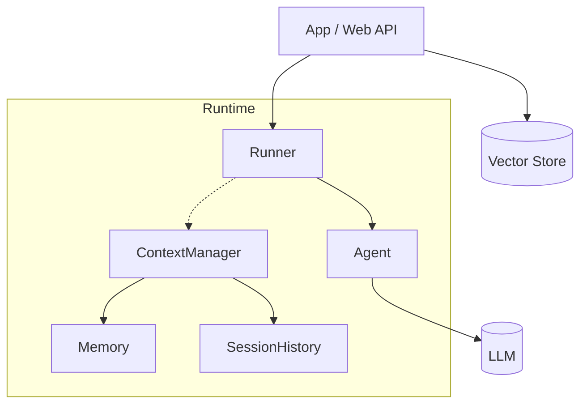

# AgentScope Runtime: Benefits (Concise)

## Core Value

- Deploy agent services fast (minutes) with `Runner` and `LocalDeployManager`
- Built‑in session history, memory, context, and streaming
- Clear, structured events for observability and debugging
- Optional sandbox isolation when executing tools
- Pluggable for RAG, embeddings, storage, and custom agents

## Architecture Snapshot

## Benefits Table

| Area | Before | With AgentScope Runtime |
|------|--------|-------------------------|
| Time‑to‑deploy | Weeks | Minutes |
| Failover | Manual | Auto‑healing |
| Context | Hand‑built | Provided |
| Streaming | Custom SSE plumbing | Built‑in |
| Observability | Ad‑hoc logs | Structured events |
| RAG | Glue code | Simple call‑outs/hooks |

## Quick Wins in Practice

- Local demo to production service: unchanged agent code
- Swap LLMs or embeddings with minimal edits
- Consistent error reporting to the UI (better UX)
- Works with or without sandbox depending on tool needs

## Getting Started

1) Define your agent (LLMAgent/AgentscopeAgent)
2) Create services (`ContextManager`, history/memory)
3) `Runner.deploy(LocalDeployManager, stream=True)`

Launch a robust, observable agent API with minimal code.

