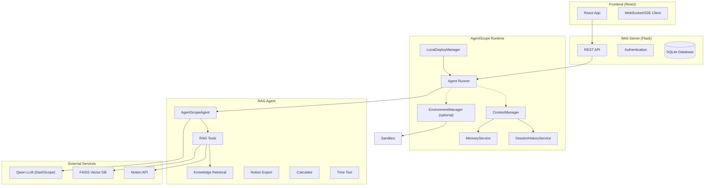

# AgentScope Runtime RAG Chatbot Demo

[](LICENSE)


---

## What is This Project?

This project is a **fully integrated AgentScope Runtime demonstration** showcasing a modern, production-ready Retrieval-Augmented Generation (RAG) chatbot system. Built entirely on **AgentScope** and **AgentScope Runtime**, it combines enterprise-grade agent deployment with advanced AI capabilities, demonstrating the power of the AgentScope ecosystem.

**🚀 Core AgentScope Runtime Features:**
- 🤖 **AgentScope Agent Integration** with ReActAgent and custom tools
- 🏗️ **Runtime Deployment** using LocalDeployManager and Runner
- 🔄 **Context Management** with session history and memory services
- 🛡️ **Sandbox Security** for safe tool execution
- 📊 **Streaming Responses** with Server-Sent Events (SSE)
- 🔧 **Tool Integration** including RAG, calculations, and Notion export

**📚 Advanced Capabilities:**
- **Dynamic Knowledge Base Management** (RAG with FAISS)
- **Multi-modal Processing** (text, images, documents)
- **Enterprise Notion Integration** with MCP protocol support
- **Secure Authentication & Authorization**
- **Comprehensive Test Suite** (43+ tests)
- **Modern Responsive UI** with real-time interactions

---

## Why Use AgentScope Runtime?

**AgentScope Runtime** is a flexible, modular framework for building enterprise-grade agentic applications:

- **🏗️ Separation of Concerns:** Cleanly separates agent logic from user interface
- **🔧 Extensibility:** Plugin architecture for tools, models, and integrations
- **👥 Multi-tenant Support:** Built-in user and session management
- **🗃️ RAG-Ready:** Native vector database support with FAISS
- **🔗 Protocol Integration:** MCP (Model Context Protocol) support for external services
- **✅ Test-Driven:** Comprehensive testing framework included
- **📈 Production Patterns:** Enterprise-grade architecture and best practices
- **🔓 Open Source:** Complete transparency and customization freedom

---

## 🚀 Quick Start

### Prerequisites

- **Python 3.11+** with pip
- **Node.js 18+** with npm
- **API Keys:** DashScope (Qwen), Notion (optional), Google (optional)
- **System Dependencies:** Poppler (for PDF processing)
- **AgentScope Runtime:** Included in requirements

### Install (first run)

```bash
# Backend deps
cd backend && pip install -r requirements.txt
# Frontend deps
cd ../frontend && npm install
cd ..
```

### Start everything (single command)

```bash
./start_servers.sh
```

**Access:**
- 🌐 **Frontend UI:** http://localhost:3000
- 🔌 **Web API:** http://localhost:5100
- 🤖 **AgentScope Runtime Agent:** http://localhost:8090/agent

### Configure backend/.env

Create `backend/.env` and set at least:

```bash
DASHSCOPE_API_KEY=your_qwen_key
DASHSCOPE_BASE_URL=https://dashscope-intl.aliyuncs.com/compatible-mode/v1
# Optional
# DASHSCOPE_MODEL=qwen-max
# FLASK_ENV=development
# SECRET_KEY=change-me
```

If you see “Error code: 404”, switch the base URL to `https://dashscope.aliyuncs.com/compatible-mode/v1` (non‑intl accounts).

---

## 🏗️ How it works (brief)

This demo wires a React UI to a Flask API, which injects KB context and streams LLM output from an Agentscope Runtime agent:



**Key AgentScope Runtime Components:**

1. **🎯 Agent Engine**: AgentScopeAgent with ReActAgent base
2. **🚀 Deployment**: LocalDeployManager for service deployment  
3. **📋 Context Management**: Unified session and memory management
4. **🛡️ Sandbox Security**: Isolated tool execution environment
5. **🔄 Streaming**: Real-time response streaming via SSE
6. **🔧 Tool Integration**: Extensible tool system with RAG capabilities


### 💬 Intelligent Conversation System
- **Multi-user Sessions:** Secure, isolated conversations per user
- **Context Preservation:** Maintains conversation history and context
- **Real-time Responses:** WebSocket-like real-time chat experience
- **Message Threading:** Organized conversation flows

### 📚 Advanced RAG (Retrieval-Augmented Generation)
- **Dynamic Knowledge Base:** Per-session document storage and retrieval
- **Vector Search:** FAISS-powered semantic search
- **Multi-format Support:** PDF, TXT, MD file processing
- **Smart Chunking:** Intelligent document segmentation
- **Relevance Scoring:** Context-aware document retrieval

### 🖼️ Multi-modal AI Processing
- **Image Analysis:** Qwen-VL-Plus powered image understanding
- **OCR Capabilities:** Extract text from images and documents
- **Visual Q&A:** Ask questions about uploaded images
- **Format Support:** JPEG, PNG, WebP, and more

### 📝 Enterprise Notion Integration
- **Hybrid Architecture:** MCP protocol + Direct API fallback
- **Conversation Export:** Save entire conversations to Notion
- **Message Export:** Export individual messages
- **Smart Formatting:** Automatic markdown conversion
- **Error Resilience:** Graceful fallback mechanisms
- **Content Splitting:** Handles large content automatically

### 🛠️ Extensible Tool System
- **Built-in Tools:** Date/time, calculator, web search
- **Tool Chaining:** Complex multi-step operations
- **Custom Tools:** Easy integration of new capabilities
- **Dynamic Loading:** Runtime tool discovery and execution

### 🔒 Security & Authentication
- **User Management:** Secure registration and login
- **Session Security:** Protected conversation access
- **Authorization:** Role-based access control
- **Data Isolation:** Per-user data segregation

### 📱 Modern User Interface
- **Responsive Design:** Works on desktop, tablet, and mobile
- **Real-time Updates:** Live message streaming
- **File Management:** Drag-and-drop file uploads
- **Markdown Rendering:** Rich text display with syntax highlighting
- **Dark/Light Themes:** Customizable appearance
- **Accessibility:** WCAG compliant interface

---

## 🧪 Comprehensive Testing Suite

The project includes a robust testing framework with **43+ tests** covering:

### Test Coverage
- **Service Layer Tests (13 tests):** Core business logic validation
- **MCP Integration Tests (14 tests):** Protocol communication testing
- **API Endpoint Tests (16 tests):** HTTP interface validation
- **Authentication Tests:** Security and authorization
- **Error Handling Tests:** Failure scenarios and recovery

### Test Categories
- ✅ **Unit Tests:** Individual component testing
- ✅ **Integration Tests:** Service interaction testing
- ✅ **API Tests:** HTTP endpoint validation
- ✅ **Security Tests:** Authentication and authorization
- ✅ **Error Handling:** Failure scenario testing

### Running Tests
```bash
# Run all tests
pytest tests/ -v

# Run specific test suites
pytest tests/test_services/test_notion_service.py -v
pytest tests/test_services/test_mcp_integration.py -v
pytest tests/test_services/test_export_routes.py -v

# Run with coverage
pytest tests/ --cov=services --cov-report=html
```

---

## 📁 Project Structure

```
agent_rag/
├── backend/                    # Python Flask backend
│   ├── api/                   # REST API endpoints
│   ├── models/                # Database models
│   ├── services/              # Business logic
│   ├── tests/                 # Comprehensive test suite
│   │   ├── test_services/     # Service layer tests
│   │   └── fixtures/          # Test data and utilities
│   ├── static/                # Static assets
│   ├── web_server.py          # Main Flask application
│   └── requirements.txt       # Python dependencies
├── frontend/                  # React frontend
│   ├── src/
│   │   ├── components/        # React components
│   │   ├── pages/            # Application pages
│   │   ├── utils/            # Utility functions
│   │   └── styles/           # CSS and styling
│   ├── public/               # Static assets
│   └── package.json          # Node.js dependencies
└── README.md                 # This file
```

---

## 🔧 Configuration

### Environment Variables (.env)
```bash
# AI Model Configuration
DASHSCOPE_API_KEY=your_qwen_api_key

# Notion Integration (Optional)
NOTION_API_KEY=your_notion_api_key
NOTION_DATABASE_ID=your_database_id

# Google Services (Optional)
GOOGLE_API_KEY=your_google_api_key
GOOGLE_SEARCH_ENGINE_ID=your_search_engine_id

# Application Settings
FLASK_ENV=development
SECRET_KEY=your_secret_key
```

### Database Configuration
- **Development:** SQLite database (included)
- **Production:** PostgreSQL/MySQL support available
- **Vector Store:** FAISS for embeddings

---

## 🎮 Usage Guide

### Getting Started
1. **👤 Login:** Use `user1/password123` or `user2/password456`
2. **💬 Create Conversation:** Start a new chat session
3. **📁 Upload Documents:** Build your knowledge base
4. **🤖 Chat:** Interact with the AI assistant
5. **📝 Export:** Save important conversations to Notion

### Advanced Features
- **📸 Image Upload:** Upload images for analysis or OCR
- **🔍 Knowledge Search:** Ask questions about your uploaded documents
- **🛠️ Tool Usage:** Use built-in tools ("What's today's date?")
- **📊 Export Options:** Save conversations or individual messages
- **⚙️ Customization:** Modify tools, models, and integrations

---

## 🔌 API Reference

### Core Endpoints
- `POST /api/auth/login` - User authentication
- `GET /api/conversations` - List user conversations
- `POST /api/chat` - Send messages
- `POST /api/upload` - Upload documents
- `POST /api/export/notion` - Export to Notion

### Notion Integration
- `POST /api/export/notion` - Export conversation
- `POST /api/export/notion/message` - Export single message

### File Management
- `POST /api/upload` - Upload documents to knowledge base
- `GET /api/files` - List uploaded files
- `DELETE /api/files/{id}` - Remove files

---

## 🛠️ Development

### Adding New Features
1. **Backend Services:** Add to `services/` directory
2. **API Endpoints:** Create in `api/` directory
3. **Database Models:** Define in `models/models.py`
4. **Tests:** Add comprehensive tests in `tests/`
5. **Frontend Components:** Create in `frontend/src/components/`

### Testing Guidelines
- Write tests for all new features
- Maintain 90%+ test coverage
- Include both success and failure scenarios
- Mock external dependencies

### Code Quality
- Follow PEP 8 for Python code
- Use ESLint for JavaScript/React
- Implement proper error handling
- Document public APIs

---

## 📋 Roadmap

### Planned Features
- [ ] **Multi-language Support** - Internationalization
- [ ] **Advanced Analytics** - Usage tracking and insights
- [ ] **Plugin Marketplace** - Community-driven extensions
- [ ] **Cloud Deployment** - Docker and Kubernetes support
- [ ] **Advanced RAG** - Graph-based knowledge representation
- [ ] **Voice Interface** - Speech-to-text and text-to-speech
- [ ] **Collaborative Features** - Shared conversations and workspaces

### Current Focus
- ✅ Notion Integration (Complete)
- ✅ Comprehensive Testing (Complete)
- ✅ Multi-modal Processing (Complete)
- 🔄 Performance Optimization (In Progress)
- 🔄 Enhanced Security (In Progress)

---

## 🤝 Contributing

We welcome contributions! Please follow these steps:

1. **Fork** the repository
2. **Create** a feature branch
3. **Add** comprehensive tests
4. **Submit** a pull request

### Development Setup
```bash
# Install development dependencies
pip install -r requirements-dev.txt
npm install --dev

# Run tests before submitting
pytest tests/ -v
npm test
```

---

## 📚 Documentation

- **API Documentation:** Available at `/api/docs` when running
- **Test Documentation:** See `tests/test_services/README_NOTION_TESTS.md`
- **Architecture Guide:** Coming soon
- **Deployment Guide:** Coming soon

---

## ❓ FAQ

**Q: Can I add my own AI models?**  
A: Yes! The framework supports multiple model providers. Modify `services/agent_service.py`.

**Q: How do I add custom tools?**  
A: Create new tool functions in `services/` and register them in the tool dispatcher.

**Q: Is this production-ready?**  
A: The core framework is robust, but review security, scaling, and deployment for production use.

**Q: Can I use different vector databases?**  
A: Yes! The RAG system is modular and supports other vector databases.

**Q: How do I deploy this?**  
A: Docker containers and cloud deployment guides are in development.

---

## 📄 License

Apache 2.0 License. See [LICENSE](LICENSE) for details.

---

## 🙏 Acknowledgments

- **AgentScope Team** - Core runtime framework
- **Alibaba DAMO** - Qwen model family
- **Notion** - API and MCP protocol support
- **FAISS** - Vector database and similarity search
- **React Team** - Frontend framework
- **Flask Team** - Backend framework

---

**Built with ❤️ using AgentScope Runtime**